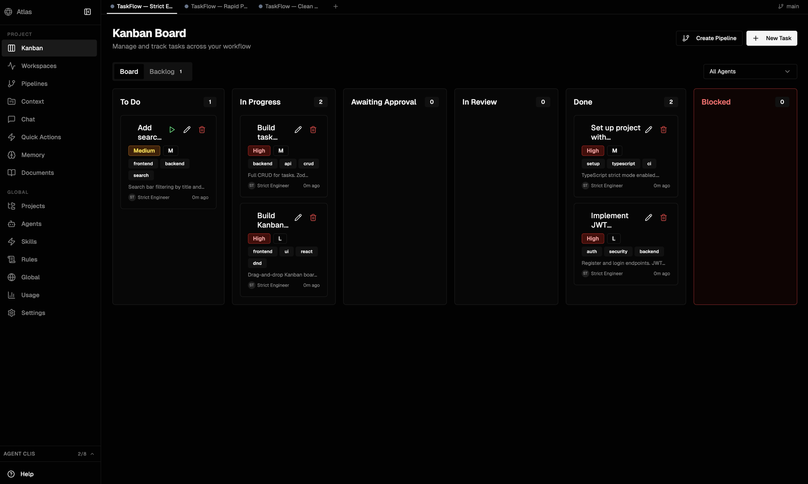
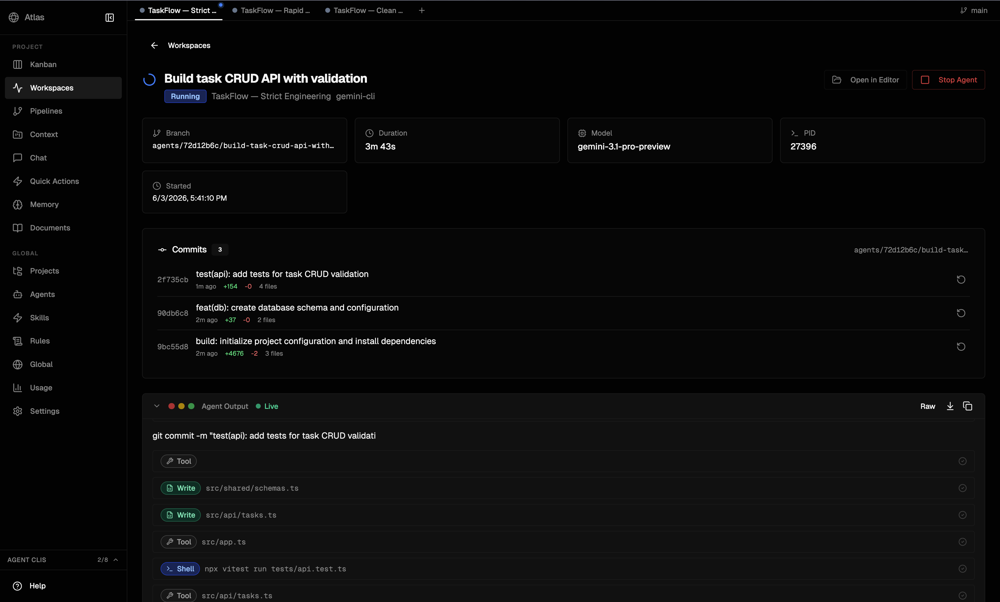
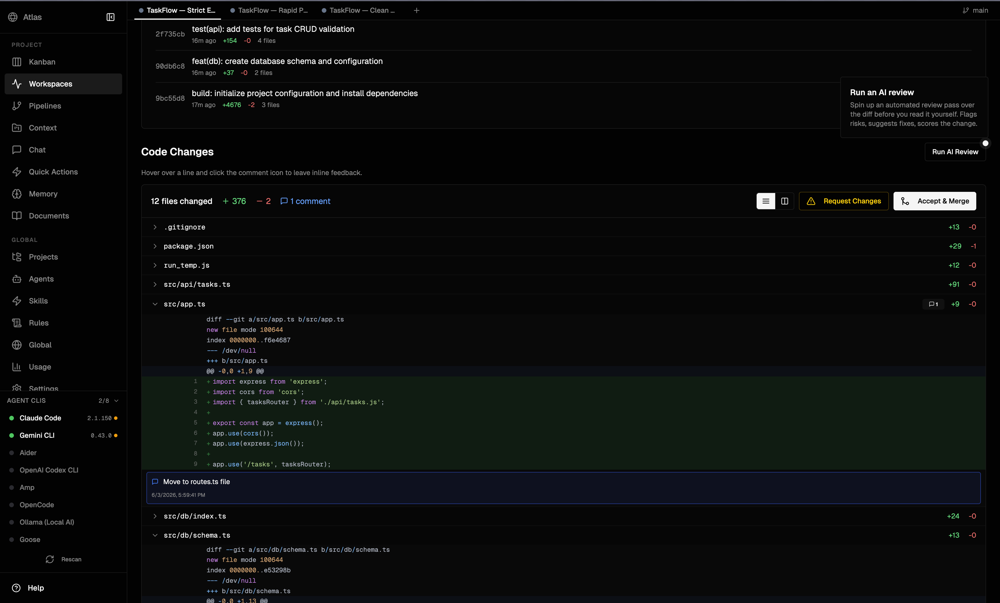
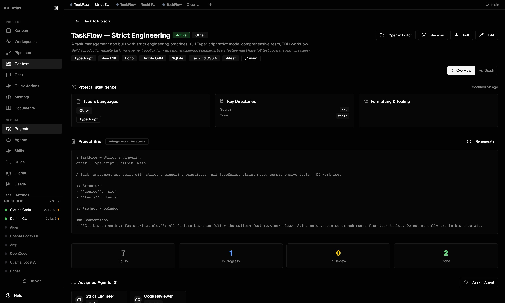
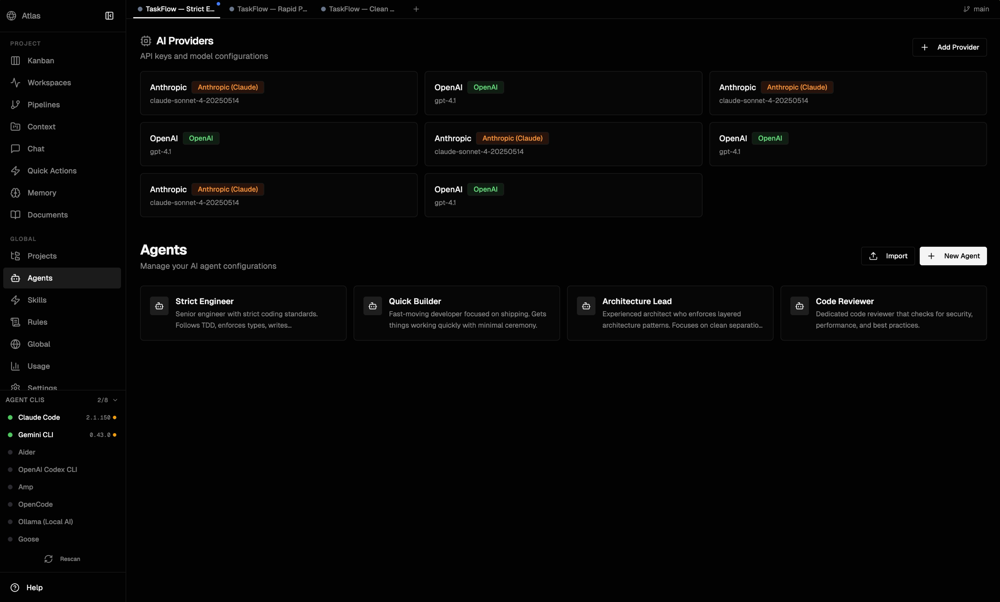
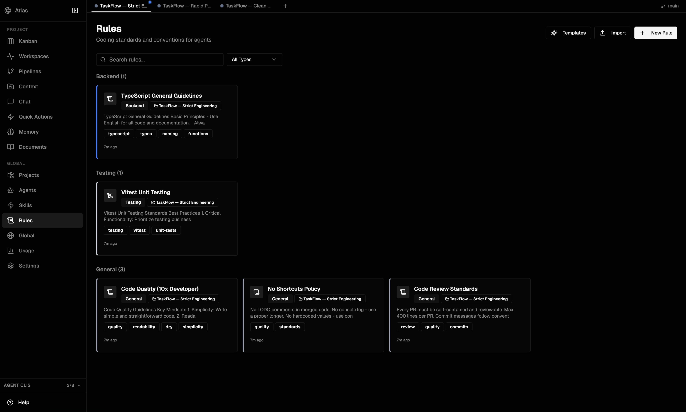
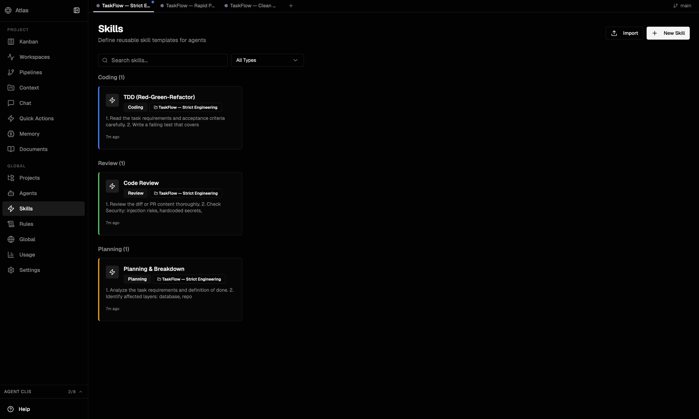

<p align="center">
  <h1 align="center">Atlas</h1>
  <p align="center">
    A local-first management hub for AI coding agents
  </p>
</p>

<p align="center">
  <a href="https://github.com/AviranLevi/atlas/actions/workflows/ci.yml"></a>
  <a href="LICENSE"></a>
  
</p>

> **Atlas is in alpha.** Expect breaking changes between minor versions until 1.0.

Atlas gives you a single place to track tasks across projects, run AI coding agents against those tasks, review their output, and build up a shared knowledge base that agents can reference during runs.

<p align="center">
  
</p>

---

## How it works

You create **tasks** on a Kanban board and assign them to **agents** (Claude Code, Aider, Gemini CLI, Codex, and more). When you start an agent on a task, Atlas:

1. Creates an **isolated git worktree** inside your project
2. Spawns the agent CLI with your task as the prompt
3. Injects project **rules**, **skills**, and **memory** via MCP
4. Streams the agent's output to the **Workspace** view in real time
5. Moves the task to **In Review** when the agent finishes

You review the diff, approve or request changes, and merge — all from the Atlas UI.

<p align="center">
  
</p>

### Code review & diff viewer

When an agent completes a task, Atlas presents the full code diff with inline commenting. You can run an **AI-powered code review** with one click, or review manually.

<p align="center">
  
</p>

---

## Features

### Project Intelligence

Atlas scans your codebase and auto-generates a **project brief** — tech stack, directory structure, conventions — that gets injected into every agent prompt. Assign multiple agents with different roles (lead, reviewer) to the same project.

<p align="center">
  
</p>

### Agents & Providers

Configure multiple AI agents with different personalities, rules, and default models. Connect providers (Anthropic, OpenAI, Google, Ollama) — each agent can use a different model.

<p align="center">
  
</p>

### Rules & Skills

**Rules** are coding standards and conventions that agents follow during runs. **Skills** are reusable step-by-step workflows (TDD, code review, planning breakdowns) that guide how agents approach tasks.

<div align="center">
  
  
</div>

### And more

- **Chat** — Conversational AI with project context, tool use, and multi-provider support (API or CLI mode)
- **Quick Actions** — One-click reusable workflows: "Fix Bug", "Write Tests", "Add API Endpoint"
- **Pipelines** — Chain tasks into sequential pipelines with auto-review and auto-accept options
- **Memory** — Persistent knowledge base (decisions, conventions, preferences) shared across agents
- **Phases** — Organize projects into milestone phases with progress tracking
- **MCP Integration** — Agents get live access to tasks, memory, rules, and skills during runs

---

## Supported agents

| Agent | MCP | Install |
|-------|-----|---------|
| [Claude Code](https://docs.anthropic.com/en/docs/claude-code) | ✓ | `npm install -g @anthropic-ai/claude-code` |
| [Gemini CLI](https://github.com/google-gemini/gemini-cli) | ✓ | `npm install -g @google/gemini-cli` |
| [Aider](https://aider.chat) | — | `pip install aider-chat` |
| [OpenAI Codex CLI](https://github.com/openai/codex) | — | `npm install -g @openai/codex` |
| [Amp](https://ampcode.com) | — | `npm install -g @sourcegraph/amp` |
| [Goose](https://github.com/block/goose) | — | see Goose docs |
| [OpenCode](https://github.com/opencode-ai/opencode) | — | `go install github.com/opencode-ai/opencode@latest` |
| [Ollama](https://ollama.ai) *(local, no API key)* | — | `ollama serve` + `pip install aider-chat` |

Agents marked **MCP ✓** get live access to the project knowledge base during runs. Others receive the task prompt only.

---

## Installation

### Quick install (recommended)

```bash
curl -fsSL https://raw.githubusercontent.com/AviranLevi/atlas/main/install.sh | bash
```

The installer handles Node.js 24 (via [fnm](https://github.com/Schniz/fnm)), pnpm, cloning, building, and optionally registers a background service that starts on login. Re-running the script performs an in-place update.

**Custom install location:**
```bash
ATLAS_HOME=/opt/atlas curl -fsSL https://raw.githubusercontent.com/AviranLevi/atlas/main/install.sh | bash
```

### Running as a background service

```bash
atlas service install    # register as LaunchAgent (macOS) or systemd unit (Linux)
atlas service uninstall  # remove the service
atlas start              # start manually without a service
atlas stop               # stop the server
atlas status             # show PID, port, health
```

### The `atlas` CLI

| Command | Description |
|---------|-------------|
| `atlas start` | Start Atlas in the background |
| `atlas stop` | Stop the server |
| `atlas restart` | Stop then start |
| `atlas status` | PID, port, HTTP health |
| `atlas logs` | Tail stdout + stderr logs |
| `atlas open` | Open http://localhost:3100 |
| `atlas update` | Pull latest, rebuild, restart |
| `atlas service install` | Register as login/boot service |
| `atlas service uninstall` | Remove service |
| `atlas uninstall` | Remove Atlas completely |

---

### Manual install (for contributors)

```bash
git clone https://github.com/AviranLevi/atlas.git
cd atlas
pnpm setup       # installs Node 24 via fnm, pnpm, dependencies, and builds
pnpm dev
```

**Or manually:**

```bash
git clone https://github.com/AviranLevi/atlas.git
cd atlas
nvm use          # Node 24 from .nvmrc
pnpm install
pnpm dev
```

Open **http://localhost:5173**. The SQLite database is created automatically.

---

## First-time setup

1. **Add a provider** — Go to **Agents → Add Provider** and enter your API key (Anthropic, OpenAI, or Google). Skip this if using Ollama only.
2. **Create a project** — Go to **Projects → New Project**. Set the **Local Path** to the absolute path of a git repository on your machine.
3. **Create an agent** — Go to **Agents → New Agent**. Pick a personality, link it to your provider, and assign it to your project.
4. **Add a task and run it** — Open your project's Kanban, create a task with a clear description and definition of done, then click **Start**.

---

## Updating

**With the CLI:**
```bash
atlas update
```

**Manual:**
```bash
git pull
pnpm install
pnpm dev
```

The database migrates automatically on startup.

---

## MCP Integration

Atlas exposes an MCP server so agents (and your IDE) can query project context directly.

### For Claude Code

Add to your `claude_desktop_config.json`:

```json
{
  "mcpServers": {
    "atlas": {
      "command": "pnpm",
      "args": ["--filter", "@atlas/server", "mcp"],
      "cwd": "/path/to/atlas"
    }
  }
}
```

### For Cursor / other HTTP clients

The HTTP/SSE MCP server runs on **http://localhost:3101** when Atlas is running. Go to **Settings** in the Atlas UI for the connection snippet.

---

## Architecture

Monorepo with three packages:

```
packages/
  shared/   # Zod schemas and TypeScript types
  server/   # Hono REST API + MCP server + Drizzle SQLite  (port 3100)
  client/   # React SPA (Vite + Tailwind + shadcn/ui)      (port 5173)
data/
  agents.db # SQLite database (gitignored, auto-created)
```

**Server layers:** Routes → Controllers → Services → Repositories → Drizzle/SQLite

See [MEMORIES.md](MEMORIES.md) for detailed architecture documentation.

## Scripts

| Command | Description |
|---------|-------------|
| `pnpm setup` | One-command dev setup (Node 24, pnpm, deps, build) |
| `pnpm dev` | Start all packages in dev mode |
| `pnpm build` | Build all packages |
| `pnpm lint` | Run Biome linter |
| `pnpm typecheck` | TypeScript type-checking |
| `pnpm test` | Run tests |
| `pnpm mcp` | Start the MCP server (stdio) |

## Environment Variables

All optional — Atlas works out of the box without a `.env` file.

| Variable | Default | Description |
|----------|---------|-------------|
| `PORT` | `3100` | Server HTTP port |
| `MCP_PORT` | `3101` | MCP HTTP/SSE server port |
| `ATLAS_AUTH_BYPASS` | `false` | Dev-only auth bypass |

See `.env.example` for the full list.

## Troubleshooting

**Locked out after clearing browser data?** Run `pnpm atlas:reset-auth`, then reload.

**Auth endpoints returning 403?** All auth endpoints require localhost origin. Use SSH tunnel for remote access.

## Roadmap to 1.0

See [docs/roadmap.md](docs/roadmap.md) for details.

- **Agent Flows** — chain agents into multi-step pipelines with visual editor
- **Semantic memory** — vector similarity search over the knowledge base
- **Event-driven triggers** — automatic rules: `onFlowComplete → save memory`
- **Remote access** — tunnel-based access to your local instance
- **End-to-end tests** — Playwright coverage for critical flows

## Contributing

See [CONTRIBUTING.md](CONTRIBUTING.md) for development setup, coding standards, and PR workflow.

## Security Note

By default, the server allows CORS from all origins for local development. Configure CORS appropriately if deploying on a shared network.

## License

[MIT](LICENSE)
